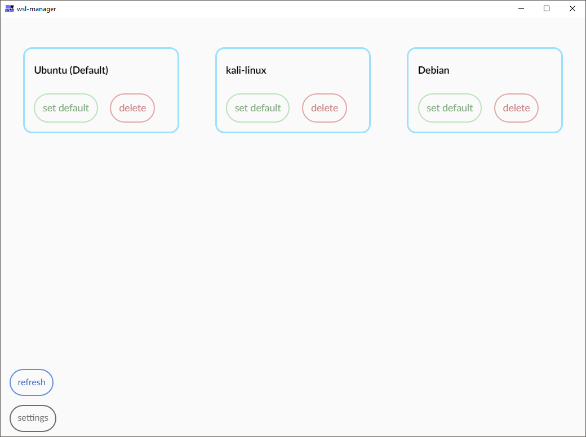
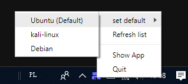

<h1 align="center">WSL-manager</h1>
<h4 align="center">An easy way to manage your multiple linux subsystems</h4>

***  
  
For now my app let's you delete or set as default any installed instance of WSL

It supports extremally useful icon in notification area which lets you set your default distribution without opening an app
  

All you need to do is download latest [release](https://github.com/JonaszPotoniec/WSL-manager/releases)  
It doesn't require installation nor admin rights.

***
<h3 align="center">Settings</h3>

<h4 align="center">Settings are stored in config.json and can be edited via in-app menu</h4>

|setting | description |
|--------|-------------|
| Close to tray   | Define if app should be closed or minimized to tray after clicking close button |
| Debug mode      | Turns on debug mode |
| Search interval | As default, distibution list only refreshes after changes like deleting or changing default. With this option you can set time in which list will be updated. It's useful if you are changing distributions frequently |

***

<h3 align="center">Debug mode</h3>
<h5 align="center">This is still work in progress and require more work</h5>
<h4 align="center">Debug mode gives you access to the console.</h4>
  

  
|setting | description |
|--------|-------------|
|updateList()|Forces refresh. Can be also done with a button|
|getDistroList()|Gives list of found distributions|
|refreshTrayIcon()|Refreshes tray icon|

Debug mode commands will be improved in the future commits
